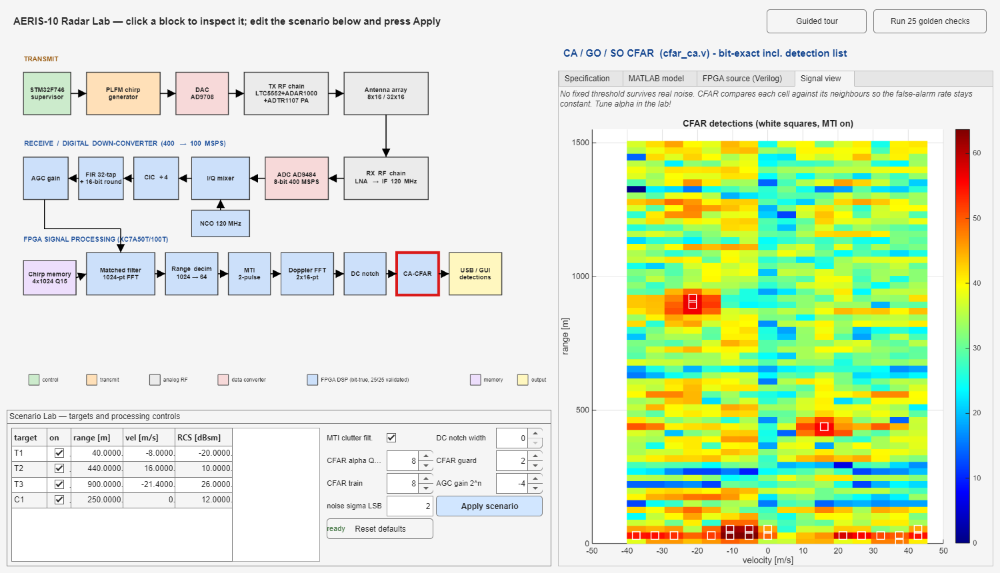

# Radar Simulation — Learn Radar Without Buying the Hardware

[](matlab/)
[](matlab/README.md)
[](https://github.com/NawfalMotii79/PLFM_RADAR)

**[AERIS-10 (PLFM_RADAR)](https://github.com/NawfalMotii79/PLFM_RADAR)** is one
of the best open-source radar projects available today: a complete 10.5 GHz
pulse-LFM phased-array radar with everything published — schematics, PCB
layouts, antenna designs, FPGA code, microcontroller firmware and GUI. Huge
credit to its author and contributors; this project builds directly on
their work (see [UPSTREAM.md](UPSTREAM.md) for the exact version reference).

**The problem: you can't learn from it without building it.** Sourcing the
PCBs, the RF chips (ADAR1000 phase shifters, ADTR1107 front ends, optional
10 W GaN power amplifiers), the antenna array, assembly and test equipment
puts a working unit at roughly **$3,000–$10,000**. For most students,
researchers and makers who simply want to understand how a radar works — or
to develop and test their own signal-processing algorithms — that cost makes
the project unreachable.

**This repository removes that barrier.** It is a complete MATLAB
simulation of the radar's digital heart: every FPGA signal-processing block
(NCO, mixer, CIC, FIR, AGC, matched filter, range decimation, MTI, Doppler
FFT, DC notch, CA-CFAR) reproduced **bit-for-bit** — the same fixed-point
arithmetic, the same truncations, the same saturations the real chip
executes — validated **25/25 bit-exact** against the golden test vectors of
the original project. On top of it sit a full end-to-end scenario simulator
(targets + clutter + noise → 8-bit ADC → pipeline → range-Doppler maps →
CFAR detections) and an **interactive radar lab**: click any part of the
radar to see its specification, its MATLAB model, its Verilog source and
its live signals — and change the scene and processing parameters from the
GUI.



## What you can do with it — for free

- **Learn the radar mechanism block by block.** A built-in **guided tour**
  walks you through the whole chain in plain language; every block shows
  its real parameters, its code and the actual signal at that point.
- **Experiment without writing code.** The **Scenario Lab** lets you edit
  targets (range / velocity / RCS), noise, AGC gain, MTI, DC notch and the
  CFAR parameters from the GUI — detector changes update instantly, scene
  changes re-run the whole 32-chirp frame through the bit-true pipeline.
  Sweep CFAR alpha and watch detections vs. false alarms; toggle MTI and
  see clutter vanish; set the gain wrong and watch FFT clipping kill the
  compression — the same lessons a $10k bench would teach.
- **Develop and test algorithms.** Swap in your own CFAR, MTI, windowing or
  detection logic in `matlab/+aeris/` and run the scenario simulator — with
  hardware-true word widths and quantization.
- **Trust the results.** `validate_against_golden.m` ties every block to
  the FPGA RTL through 25 bit-exact checks, so behaviour you develop here
  transfers to the real hardware.

## Quick start

Requirements: any recent MATLAB (no toolboxes needed).

```matlab
cd matlab
aeris_explorer               % interactive radar lab (the screenshot above)
aeris_endtoend_sim           % full 32-chirp scenario -> maps + detections (~25 s)
validate_against_golden      % 25 bit-exact checks vs the FPGA golden vectors
```

## Repository layout

| Path | Contents |
|---|---|
| `matlab/` | the complete simulation suite (`+aeris/` block models, lab, validation) |
| `reference/fpga/` | the upstream files the suite needs, vendored verbatim: chirp `.mem` tables, FFT twiddle ROMs, the Verilog sources shown in the explorer, and the golden test vectors (~1.5 MB) |
| `docs/` | screenshots |
| `generated/` | simulation outputs (created at runtime, not tracked) |
| [`UPSTREAM.md`](UPSTREAM.md) | exact provenance: which upstream version, which files, which licenses |

Details, the block-to-source map and the RTL findings the simulation
surfaced (NCO quadrant mapping, FFT saturation vs AGC, CFAR threshold
semantics, …) are in [`matlab/README.md`](matlab/README.md).

## Credits

- Original hardware/FPGA/firmware project: **AERIS-10** by
  [NawfalMotii79/PLFM_RADAR](https://github.com/NawfalMotii79/PLFM_RADAR)
  (software/FPGA code MIT-licensed; vendored files listed in
  [UPSTREAM.md](UPSTREAM.md)).
- MATLAB bit-true simulation suite and radar lab: this repository (MIT).

If the simulation gets you hooked and you *do* want to build the real
thing one day — everything you need is in the upstream project.
